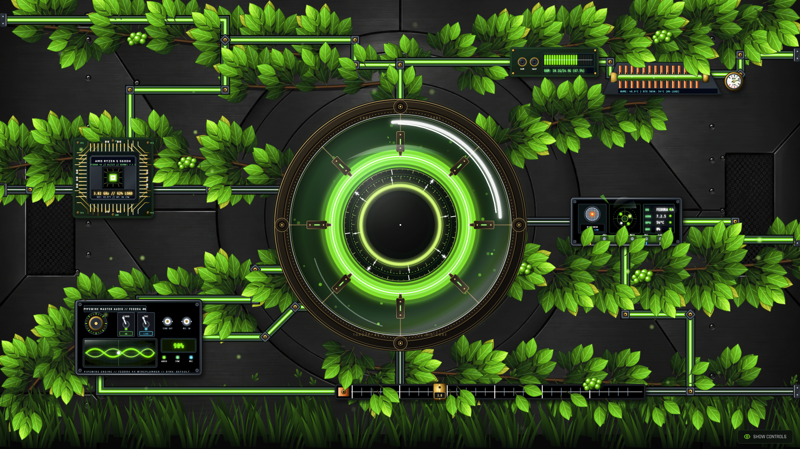

  
  <h1>CyberCore Reactor Terminal</h1>
  
Procedural Biomechanical Cybernetic Reactor UI with Real-Time Telemetry & Audio Synthesis

View your app in AI Studio: https://ai.studio/apps/5a96c8c5-0a18-4069-87f5-4a1321474b2e

## Run Locally

**Prerequisites:**  Node.js

1. Install dependencies:
   `npm install`
2. Set the `GEMINI_API_KEY` in [.env.local](.env.local) to your Gemini API key
3. Run the app:
   `npm run dev`
