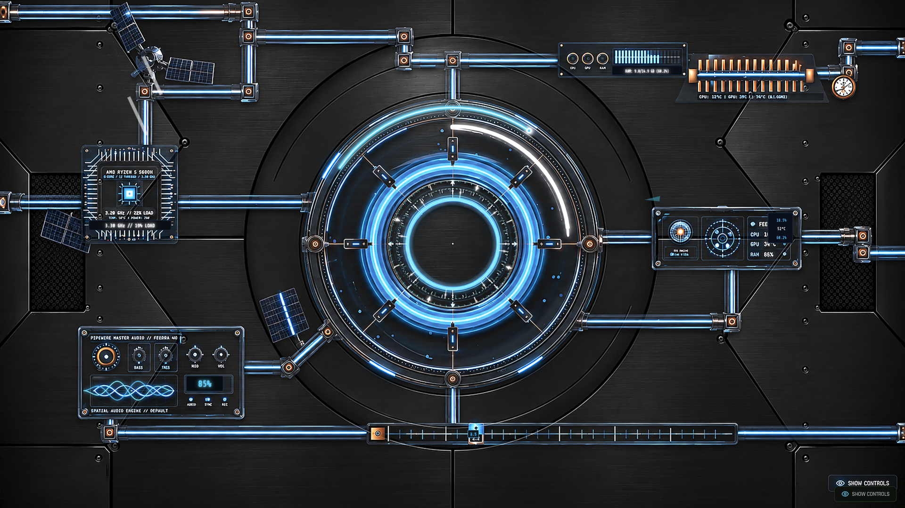

<div align="center">

# 🌌 CyberCore Reactor Terminal MK-IV

**Photorealistic 8K Deep Space Cybernetic Reactor Terminal with Real-Time Linux Kernel Telemetry**



</div>

---

## ⚡ Overview

CyberCore Reactor Terminal is an 8K photorealistic cybernetic reactor interface designed for deep-space telemetry, system monitoring, and immersive ambient audio.

- **8K Photorealistic Hardware Layer**: 7680 × 4322 native UHD brushed titanium bulkhead with multi-tier contact shadows.
- **Quantum Bio-Reactor Core**: Counter-rotating chronometer reticles, high-speed orbital neon plasma sweep, and singularity pulse.
- **Live Fedora Linux Telemetry**: Real-time AMD Ryzen CPU frequency & load, k10temp thermal metrics, PipeWire master audio volume, and system load average tracking.
- **Interactive Oscilloscope & Controls**: Real-time harmonic standing wave canvas, tactical radar sweep, and physical Phoenix bus pins.
- **Ambient Space Audio**: Integrated soothing background audio (Hans Zimmer - S.T.A.Y Interstellar Theme).

---

## 🚀 Getting Started

### Prerequisites
- Node.js (v18+)
- Python 3 (for hardware sensor daemon, optional)

### Run Locally

1. Install dependencies:
   ```bash
   npm install
   ```

2. Launch development server (Port 3007):
   ```bash
   npm run dev
   ```

3. Launch with full desktop window & hardware telemetry:
   ```bash
   python3 run_terminal_nvidia.py
   ```

---

## 🛠️ Tech Stack
- **Frontend**: React 19, TypeScript, Tailwind CSS, Framer Motion, HTML5 Canvas
- **VFX / Rendering**: 8K UHD composited hardware layer, SVG laser optics, Web Audio API
- **Telemetry**: Linux `/proc` and `sysfs` kernel probes (AMD k10temp, PipeWire, NVIDIA dGPU)
